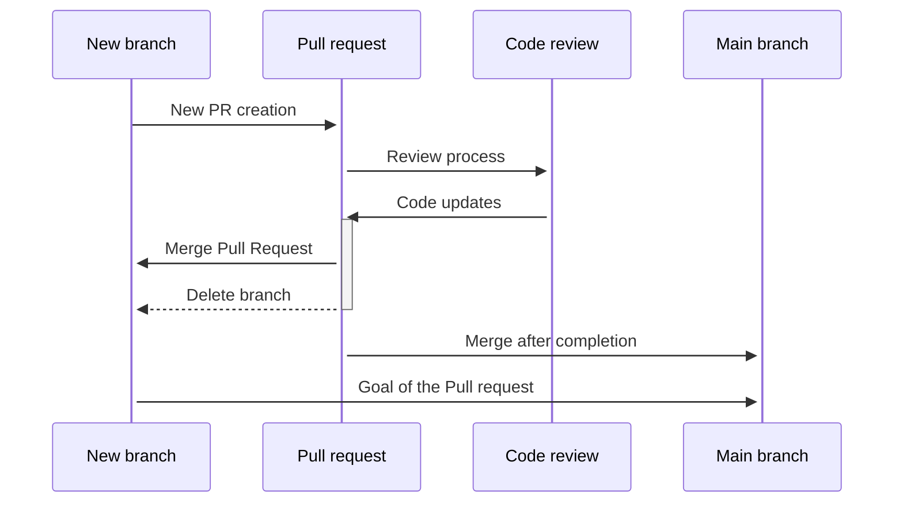

# プルリクエスト

※ オリジナル: https://microsoft.github.io/code-with-engineering-playbook/code-reviews/inclusion-in-code-review/

メインコードベース（Gitリポジトリのメインブランチなど）への変更は、プルリクエスト（PR）を使用して行う必要があります。

プルリクエストの有効化:

* コード検査 -[コードレビュー](./README.md)を参照
* コードの自動認定の実行
  * リンター
  * コンパイル
  * ユニットテスト
  * 統合テストなど。

プルリクエストの要件は、最新のバージョン管理および作業項目追跡システムで設定できるポリシーによって実施でき、実施する必要があります。詳細については、[証拠と対策](./evidence-and-measures/README.md)セクションを参照してください。

## 一般的なプロセス

1. 手元のタスクの明確に定義された説明と受け入れ基準に基づいて変更を実装します
1. 次に、新しいプルリクエストを作成する前に :
    * コードが合意されたコーディング規約に準拠していることを確認します
        * れはlintersを使用して部分的に自動化できます
    * コードがエラーや警告なしにコンパイルおよび実行されることを確認します
    * 変更をカバーするテストを作成および/または更新しますそして、すべての新規および既存のテストに合格することを確認します
    * 変更に一致するようにドキュメントを作成および/または更新します
1. 上記の基準が満たされていることを確認したら、[プルリクエストテンプレート](pull-request-template/pull-request-template.md)に準拠した新しいプルリクエストを作成して送信します。
2. [コードレビュー](./process-guidance/README.md)プロセスに従って、変更をメインコードベースにマージします

次の図は、このアプローチを示しています。



## サイズガイダンス

プルリクエストを常に小さく保つことを目指す必要があります。小さなPRには複数の利点があります。

* レビューが簡単です。レビューアにとって明らかなメリット。
* 展開が簡単です。これは、迅速にリリースし、頻繁にリリースするという戦略と一致しています。
* 発生する可能性のある競合と古いPRを最小限に抑えます。

ただし、PRを集中させておく必要があります。たとえば、機能機能、最適化、コードの可読性などに焦点を当て、コンテキストのないコードや疎結合のコードを含むPRは避けてください。適切なサイズはありませんが、コードレビューは共同プロセスであることに注意してください。大きなPRは困難であるため、レビューに時間がかかる可能性があります。私たちは常に、付加価値を残したまま、可能な限り小さなPRを持つよう努めるべきです。

## ベストプラクティス

サイズを超えて、すべてのPRは次のことを行う必要があることに注意してください。

* 一貫性を保つ、
* ビルドを壊さないでください、そして
* PRの一部として関連するテストを含めます。

一貫性があるということは、PRに含まれるすべての変更が、1つの目標（たとえば、1つのユーザーストーリー）を解決することを目的とし、本質的に関連している必要があることを意味します。これをプロジェクト全体の単一責任の原則と考えると、PRにはプロジェクトを*変更する理由*が1つだけあるはずです。

小さく始めてください。大きなPRを分割するよりも、最初から小さなPRを作成する方が簡単です。

これらは、必然性の「原因」に応じてPRを小さく保つためのいくつかの戦略です。PRを自己コンテナの変更に分割して、付加価値を付けたり、非表示の機能をリリースしたりできます（機能フラグ、機能の切り替え、カナリアのリリースを参照）。 PRをさまざまなレイヤーに分割します（たとえば、MVCやオブザーバー/サブジェクトなどのデザインパターンを使用します）。戦略に関係なく。

## プルリクエストの説明

よく書かれたPRの説明は、クリーンで構造化された変更履歴を維持するのに役立ちます。すべてのチームが同じ仕様に準拠する必要はありませんが、プロジェクトの開始時に規則に同意することが重要です。

オープンソースプロジェクトやその他の一般的な仕様の1つは、次のように構成された[従来のコミット仕様](https://www.conventionalcommits.org/en/v1.0.0-beta.2/)です。

```txt
<type>[optional scope]: <description>

[optional body]

[optional footer]
```

この`<type>`メッセージのは、チームによって定義されたタイプのリストから選択できますが、多くのプロジェクトでは、[Angularオープンソースプロジェクトのコミットタイプのリスト](https://github.com/angular/angular/blob/22b96b9/CONTRIBUTING.md#type)を使用しています。`scope`、`body`および`footer`要素は**オプションである**ことは明らかですが、必須`type`で短い説明があると、上記の機能が有効になります。

[プルリクエストテンプレート](pull-request-template/pull-request-template.md)も参照してください。

## 参考資料

* [優れたプルリクエストの説明を書く](https://www.pullrequest.com/blog/writing-a-great-pull-request-description)
* [プルリクエストを含むコードを確認する（Azure DevOps）](https://docs.microsoft.com/en-us/azure/devops/repos/git/pull-requests?view=azure-devops)
* [問題とプルリクエストのコラボレーション（GitHub）](https://help.github.com/en/github/collaborating-with-issues-and-pull-requests)
* [PRサイズへのGoogleのアプローチ](https://google.github.io/eng-practices/review/developer/small-cls.html)
* [機能フラグ](https://www.martinfowler.com/articles/feature-toggles.html)
* [隠された機能へのFacebookのアプローチ](https://launchdarkly.com/blog/secret-to-facebooks-hacker-engineering-culture/)
* [カナリアリリースへのAzureアプローチ](https://docs.microsoft.com/azure/architecture/framework/devops/release-engineering-cd#stage-your-workloads)
* [従来のコミット仕様](https://www.conventionalcommits.org/en/v1.0.0-beta.2/)
* [AngularCommitタイプ](https://github.com/angular/angular/blob/22b96b9/CONTRIBUTING.md#type)
